<div align="center">


<h1>Lakehouse Infrastructure-as-Code (IaC) Platform</h1>

<p><strong>The Institutional-Grade Blueprint for Modern Data Lakehouse Architectures, Automated Governance, and Multi-Cloud Data Engineering</strong></p>

[]()
[]()
[]()
[]()

<br/>

> **"Data is the fuel, but the Lakehouse is the refinery."** 
> Lakehouse IaC is a flagship solution for modern Data Platform Engineering and Analytics organizations. By orchestrating unified storage tiers, Spark-based compute clusters, and automated metadata-driven pipelines, it ensures that institutional data is governed, high-quality, and ready for advanced analytics and machine learning.

</div>

---

## 🏛️ Executive Summary

The **Lakehouse IaC Platform** is a specialized flagship solution designed for Data Architects, Data Engineers, and Analytics Leaders. As organizations struggle with the divide between "Data Lakes" (flexible but messy) and "Data Warehouses" (structured but expensive), the Lakehouse architecture emerges as the unified standard. This platform addresses the complexity of provisioning, securing, and governing this hybrid environment using Infrastructure-as-Code.

This platform provides a **Unified Data Intelligence Plane**. It demonstrates how to orchestrate institutional data—using **FastAPI**, **React 18**, **Apache Spark**, and **Delta/Iceberg**—to create a "Data-First" culture. By providing **Metadata-Driven Ingestion**, **End-to-End Lineage**, and **Automated Quality Validation**, it enables organizations to move from "Data Silos" to "Data Value."

---

## 📉 The "Data Fragmentation" Problem

Enterprises scaling data operations face existential challenges:
- **Siloed Architectures**: Maintaining separate environments for BI (Warehouse) and AI/ML (Lake) leading to data duplication and inconsistency.
- **Governance Gaps**: Difficulty enforcing consistent access controls, data masking, and lineage tracking across disparate storage and compute systems.
- **Pipeline Fragility**: Manual, ad-hoc ETL pipelines that lack automated schema evolution, versioning, and validation.
- **Cost Inefficiency**: Under-utilized compute clusters and expensive storage models without automated tiering and FinOps visibility.

---

## 🚀 Strategic Drivers & Business Outcomes

### 🎯 Strategic Drivers
- **Lakehouse Unification**: Implementing open table formats (Delta Lake, Iceberg) to enable ACID transactions and schema enforcement on low-cost object storage.
- **Metadata-Driven Orchestration**: Automating pipeline generation and data movement based on a centralized catalog and metadata registry.
- **Governance as Code**: Enforcing role-based and attribute-based access control (RBAC/ABAC) directly via the IaC platform.

### 💰 Business Outcomes
- **50% Faster Time-to-Insight**: Reducing the data engineering bottleneck through automated ingestion and standardized transformation patterns.
- **100% Data Traceability**: Providing auditors and compliance teams with full end-to-end lineage for every data asset.
- **Significant Infrastructure Savings**: Optimizing compute and storage costs through automated cluster scaling and data lifecycle management.

---

## 📐 Architecture Storytelling: 80+ Advanced Diagrams

### 1. Executive Lakehouse Architecture
*The orchestration of Storage Tiers, Spark Compute, and Governance.*
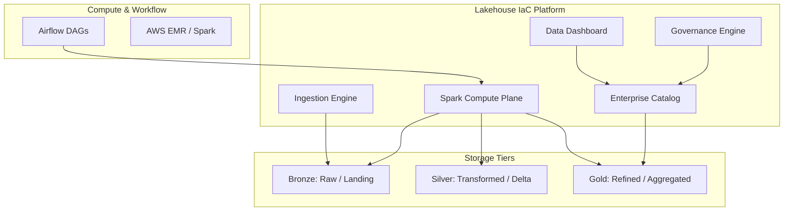

### 2. Metadata-Driven Ingestion Lifecycle
*From raw source to Bronze landing zone.*
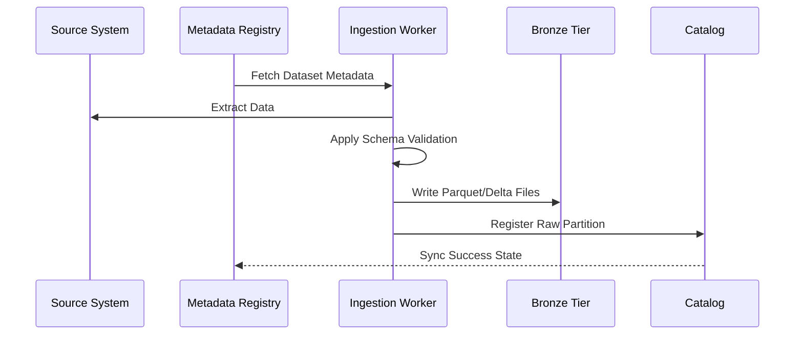

### 3. The "Medallion" Processing Flow
*Refining data through Bronze, Silver, and Gold tiers.*
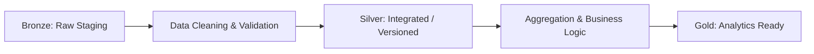

### 4. Data Lineage Tracking Model
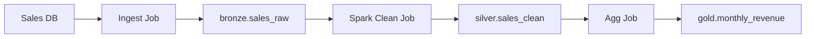

### 5. Governance: RBAC & Data Masking
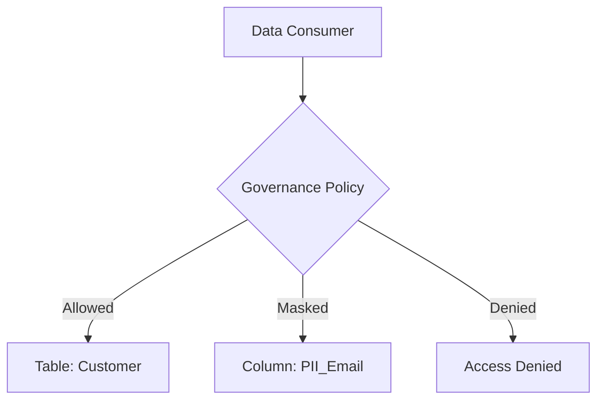

### 6. Schema Evolution Handling
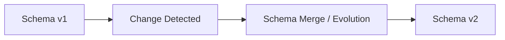

### 7. Data Quality Validation Loop
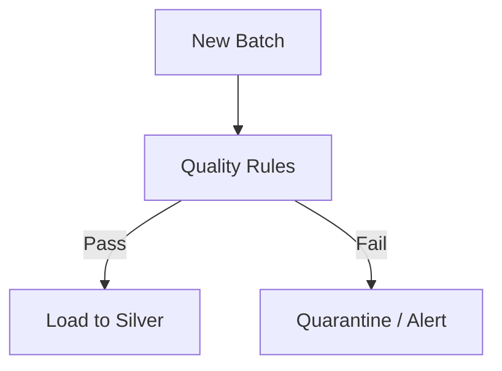

### 8. Multi-Cloud Storage Abstraction
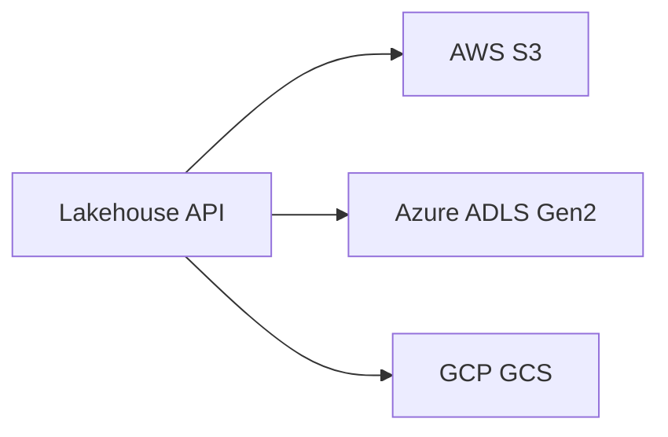

### 9. Compute Cluster Lifecycle (Auto-Scaling)
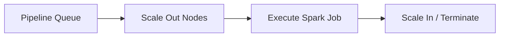

### 10. Lakehouse Cost Visibility
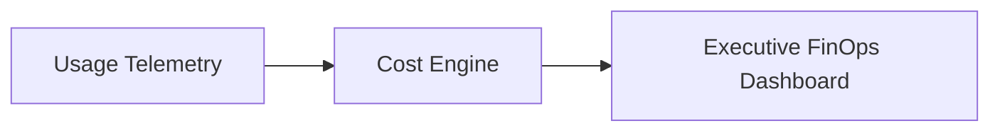

### 11. Data lake unification
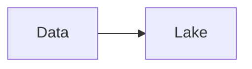

### 12. Data warehouse unification
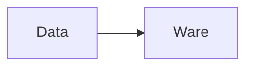

### 13. Infrastructure provisioning
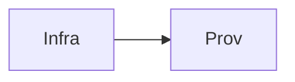

### 14. Data ingestion pipeline
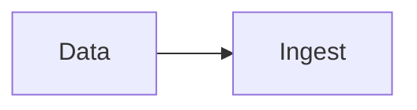

### 15. Batch data processing
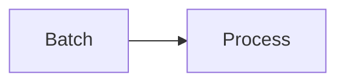

### 16. Streaming data processing
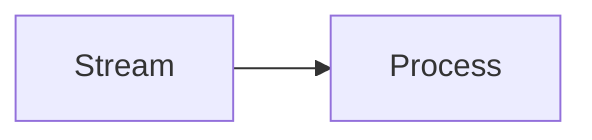

### 17. Data catalog flow
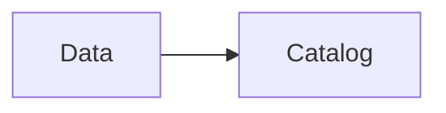

### 18. Data governance flow
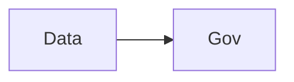

### 19. Data quality validation


### 20. Data security flow
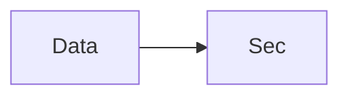

### 21. Data encryption flow
```mermaid
graph LR
    D[Data] --> E[Enc]
```

### 22. RBAC access control
```mermaid
graph LR
    R[RBAC] --> A[Access]
```

### 23. ABAC access control
```mermaid
graph LR
    A[ABAC] --> A[Access]
```

### 24. Multi-tenant data architecture
```mermaid
graph LR
    M[Multi] --> T[Tenant]
```

### 25. Data lineage tracking
```mermaid
graph LR
    D[Data] --> L[Line]
```

### 26. Metadata management flow
```mermaid
graph LR
    M[Meta] --> M[Manage]
```

### 27. Analytics integration flow
```mermaid
graph LR
    A[Analy] --> I[Integ]
```

### 28. BI tool integration
```mermaid
graph LR
    B[BI] --> T[Tool]
```

### 29. Cost optimization strategy
```mermaid
graph LR
    C[Cost] --> O[Opti]
```

### 30. Data lifecycle management
```mermaid
graph LR
    D[Data] --> L[Life]
```

### 31. Compliance audit logging
```mermaid
graph LR
    C[Comp] --> A[Audit]
```

### 32. Multi-cloud deployment
```mermaid
graph LR
    M[Multi] --> C[Cloud]
```

### 33. Delta Lake table format
```mermaid
graph LR
    D[Delta] --> T[Table]
```

### 34. Apache Iceberg format
```mermaid
graph LR
    A[Apache] --> I[Iceberg]
```

### 35. Apache Hudi format
```mermaid
graph LR
    A[Apache] --> H[Hudi]
```

### 36. Ingestion engine pipeline
```mermaid
graph LR
    I[Ingest] --> E[Engine]
```

### 37. Processing engine flow
```mermaid
graph LR
    P[Process] --> E[Engine]
```

### 38. Governance engine flow
```mermaid
graph LR
    G[Gov] --> E[Engine]
```

### 39. Analytics engine flow
```mermaid
graph LR
    A[Analy] --> E[Engine]
```

### 40. Apache Spark compute
```mermaid
graph LR
    A[Apache] --> S[Spark]
```

### 41. Apache Airflow workflow
```mermaid
graph LR
    A[Apache] --> A[Airflow]
```

### 42. Kafka streaming integration
```mermaid
graph LR
    K[Kafka] --> S[Stream]
```

### 43. Hive Metastore sync
```mermaid
graph LR
    H[Hive] --> M[Meta]
```

### 44. AWS Glue catalog
```mermaid
graph LR
    A[AWS] --> G[Glue]
```

### 45. Unity Catalog flow
```mermaid
graph LR
    U[Unity] --> C[Catalog]
```

### 46. Storage tiering strategy
```mermaid
graph LR
    S[Store] --> T[Tier]
```

### 47. Compute cluster lifecycle
```mermaid
graph LR
    C[Comp] --> L[Life]
```

### 48. Networking architecture
```mermaid
graph LR
    N[Net] --> A[Arch]
```

### 49. Monitoring: Prometheus
```mermaid
graph LR
    M[Mon] --> P[Prom]
```

### 50. Monitoring: Grafana
```mermaid
graph LR
    M[Mon] --> G[Graf]
```

### 51. Monitoring: Alerts
```mermaid
graph LR
    M[Mon] --> A[Alert]
```

### 52. CI/CD: Build pipeline
```mermaid
graph LR
    C[CICD] --> B[Build]
```

### 53. CI/CD: Test pipeline
```mermaid
graph LR
    C[CICD] --> T[Test]
```

### 54. CI/CD: Deploy pipeline
```mermaid
graph LR
    C[CICD] --> D[Deploy]
```

### 55. Lakehouse UI: Dashboard
```mermaid
graph LR
    U[UI] --> D[Dash]
```

### 56. Lakehouse UI: Catalog
```mermaid
graph LR
    U[UI] --> C[Catalog]
```

### 57. Lakehouse UI: Lineage
```mermaid
graph LR
    U[UI] --> L[Lineage]
```

### 58. Lakehouse UI: Quality
```mermaid
graph LR
    U[UI] --> Q[Quality]
```

### 59. API: Dataset creation
```mermaid
graph LR
    A[API] --> D[Dataset]
```

### 60. API: Pipeline run
```mermaid
graph LR
    A[API] --> P[Pipeline]
```

### 61. API: Catalog fetch
```mermaid
graph LR
    A[API] --> C[Catalog]
```

### 62. API: Quality status
```mermaid
graph LR
    A[API] --> Q[Quality]
```

### 63. Worker: Ingestion
```mermaid
graph LR
    W[Worker] --> I[Ingest]
```

### 64. Worker: Processing
```mermaid
graph LR
    W[Worker] --> P[Process]
```

### 65. Worker: Quality
```mermaid
graph LR
    W[Worker] --> Q[Quality]
```

### 66. Worker: Governance
```mermaid
graph LR
    W[Worker] --> G[Gov]
```

### 67. Worker: Analytics
```mermaid
graph LR
    W[Worker] --> A[Analy]
```

### 68. Schema drift detection
```mermaid
graph LR
    S[Schema] --> D[Drift]
```

### 69. Data versioning flow
```mermaid
graph LR
    D[Data] --> V[Version]
```

### 70. Time travel query flow
```mermaid
graph LR
    T[Time] --> T[Travel]
```

### 71. Column-level security
```mermaid
graph LR
    C[Column] --> S[Sec]
```

### 72. Data masking strategy
```mermaid
graph LR
    D[Data] --> M[Mask]
```

### 73. Multi-tenant isolation
```mermaid
graph LR
    M[Multi] --> I[Iso]
```

### 74. Storage tiering flow
```mermaid
graph LR
    S[Store] --> T[Tier]
```

### 75. Metadata-driven pipeline
```mermaid
graph LR
    M[Meta] --> P[Pipeline]
```

### 76. Governance policy enforcement
```mermaid
graph LR
    G[Gov] --> P[Policy]
```

### 77. Compliance audit trail
```mermaid
graph LR
    C[Comp] --> A[Audit]
```

### 78. Value realization model
```mermaid
graph LR
    V[Val] --> R[Real]
```

### 79. FinOps visibility flow
```mermaid
graph LR
    F[FinOps] --> V[Vis]
```

### 80. Lakehouse ecosystem
```mermaid
graph LR
    L[Lake] --> E[Eco]
```

---

## 🛠️ Technical Stack & Implementation

### Ingestion & Processing Engine
- **Processing**: Python 3.11+ / PySpark / Apache Spark
- **Orchestration**: Apache Airflow / TaskFlow API.
- **Storage**: Delta Lake / Apache Iceberg on S3/ADLS.

### Frontend (Data Intelligence Hub)
- **Framework**: React 18 / Vite
- **Visuals**: Recharts (Pipeline Success, Throughput, Quality Scores).
- **Theme**: Indigo, Slate, and Emerald (Institutional Data Aesthetics).

### Infrastructure
- **Cloud**: AWS EMR / Azure Databricks / GCP Dataproc.
- **Security**: RBAC/ABAC Governance, OIDC Identity.

---

## 🚀 Deployment Guide

### Local Development
```bash
# Clone the repository
git clone https://github.com/devopstrio/lakehouse-iac.git
cd lakehouse-iac

# Setup environment
cp .env.example .env

# Launch services
make up
```
Access the Data Intelligence Hub at `http://localhost:3000`.

---

## 📜 License
Distributed under the MIT License. See `LICENSE` for more information.
