<div align="center">


<h1>Lakehouse IaC</h1>

<p><strong>The Institutional-Grade Blueprint for Modern Data Lakehouse Architectures, Automated Governance, and Multi-Cloud Data Engineering.</strong></p>

[]()
[]()
[]()

<br/>

> **"Data is the fuel, but the Lakehouse is the refinery."** 
> **Lakehouse IaC** is an enterprise-grade platform designed to provide a secure, measurable, and highly automated foundation for global data operations. It orchestrates the complex lifecycle of lakehouse data—from multi-source unified ingestion and medallion-tier refinement to distributed compute orchestration and unified data governance.

</div>

---

## 🏛️ Executive Summary

Fragmented data silos and manual ETL processes are strategic operational liabilities; lack of centralized data orchestration is a primary barrier to organizational AI/ML scaling. Organizations fail to achieve rapid data value not because of a lack of data, but because of fragmented data standards, lack of automated quality validation, and an inability to orchestrate complex data pipelines with operational precision.

This platform provides the **Data Intelligence Plane**. It implements a complete **Enterprise Lakehouse-as-Code Framework**, enabling Data and Platform teams to manage global data assets as first-class citizens. By automating the transition of data through Medallion tiers (Bronze, Silver, Gold) and orchestrating real-time Spark compute clusters, we ensure that every organizational insight—from raw IoT streams to curated business reports—is validated by default, audited for history, and strictly aligned with institutional data frameworks.

---

## 📐 Architecture Storytelling: Principal Reference Models

### 1. Principal Architecture: Global Lakehouse Ingestion & Intelligence Plane
This diagram illustrates the end-to-end flow from multi-source unified ingestion and medallion refinement to distributed compute, data governance, and institutional data auditing.

```mermaid
graph LR
    %% Subgraph Definitions
    subgraph DataIngress["Multi-Source Data Ingress"]
        direction TB
        SaaS_Data["SaaS & API Data"]
        RDBMS_Data["Database Replication"]
        IoT_Stream["High-Velocity IoT Streams"]
    end

    subgraph IntelligenceEngine["Data Intelligence Hub"]
        direction TB
        API["FastAPI Lakehouse Gateway"]
        MedallionOrch["Medallion Tier Orchestrator"]
        GovernanceEngine["Data Governance & RBAC"]
        CatalogBot["Automated Data Catalog"]
    end

    subgraph ComputePlane["Distributed Compute Fleet"]
        direction TB
        SparkClusters["Spark / Databricks Clusters"]
        QueryEngines["Snowflake / Athena Engines"]
        QualityWorkers["Data Quality Validation Fleet"]
    end

    subgraph OperationsHub["Institutional Data Hub"]
        direction TB
        Scorecard["Data Maturity Score"]
        Analytics["Ingestion & Query Stats"]
        Audit["Forensic Data Metadata Lake"]
    end

    subgraph DevOps["Lakehouse-as-Code Framework"]
        direction TB
        TF["Terraform Data Modules"]
        LineageBot["Automated Lineage Mapper"]
        ChatOps["Data Approval Hub"]
    end

    %% Flow Arrows
    DataIngress -->|1. Submit Raw Data| API
    API -->|2. Ingest to Bronze| MedallionOrch
    MedallionOrch -->|3. Cleanse to Silver| MedallionOrch
    MedallionOrch -->|4. Aggregate to Gold| MedallionOrch
    
    MedallionOrch -->|5. Execute Compute| ComputePlane
    ComputePlane -->|6. Notify Progress| ChatOps
    API -->|7. Visualize Health| Scorecard
    
    Scorecard -->|8. Track Latency| Analytics
    Scorecard -->|9. Record Query| Audit
    
    TF -->|10. Provision Hub| IntelligenceEngine
    LineageBot -->|11. Inject Lineage| MedallionOrch
    Audit -->|12. Improve Quality| ComputePlane

    %% Styling
    classDef ingress fill:#f5f5f5,stroke:#616161,stroke-width:2px;
    classDef intel fill:#e8eaf6,stroke:#1a237e,stroke-width:2px;
    classDef compute fill:#e1f5fe,stroke:#01579b,stroke-width:2px;
    classDef ops fill:#ede7f6,stroke:#311b92,stroke-width:2px;
    classDef devops fill:#e8f5e9,stroke:#1b5e20,stroke-width:2px;

    class DataIngress ingress;
    class IntelligenceEngine intel;
    class ComputePlane compute;
    class OperationsHub ops;
    class DevOps devops;
```

### 2. The Lakehouse Data Lifecycle Flow
The continuous path of a data asset from initial ingestion and Bronze-tier landing to active Silver-tier cleansing, Gold-tier aggregation, and institutional forensic auditing.

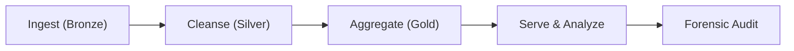

### 3. Medallion Architecture Topology
Strategically refining data through hierarchical storage tiers, providing a unified institutional view from raw technical streams to curated, business-ready insight models.

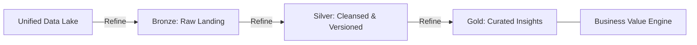

### 4. Multi-Source Unified Ingestion Flow
Handling complex data types—including batch SaaS ingestion, real-time database CDC, and high-velocity IoT streams—into a single, governed Lakehouse entry point.

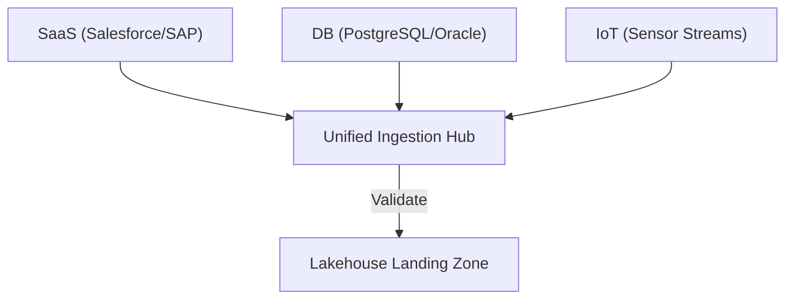

### 5. Distributed Compute & Query Orchestration Flow
Managing the sequential execution of Spark, Databricks, or Snowflake query jobs, ensuring that compute resources are scaled dynamically to meet massive dataset processing demands.

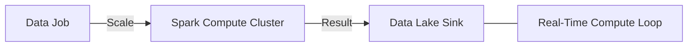

### 6. Data Governance & Cataloging Flow
Automatically managing metadata, end-to-end data lineage, and asset discovery across the global Lakehouse, ensuring institutional data integrity and visibility.

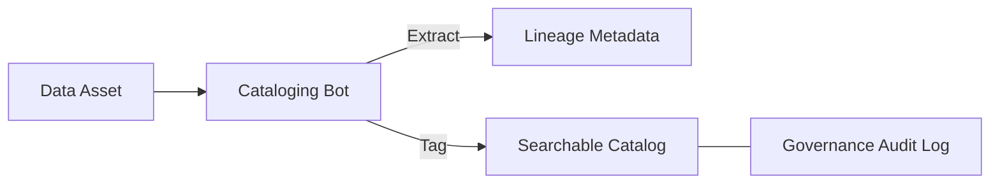

### 7. Institutional Data Maturity Scorecard
Grading organizational performance based on key indicators: Data Quality Index, Processing Latency, and Cost Per Query Efficiency.

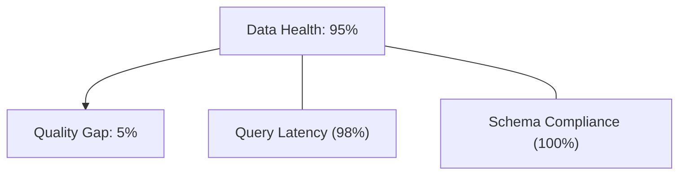

### 8. Identity & RBAC for Data Governance
Managing fine-grained access to sensitive data tiers, compute triggers, and audit logs between Data Scientists, Engineers, and Compliance Officers.

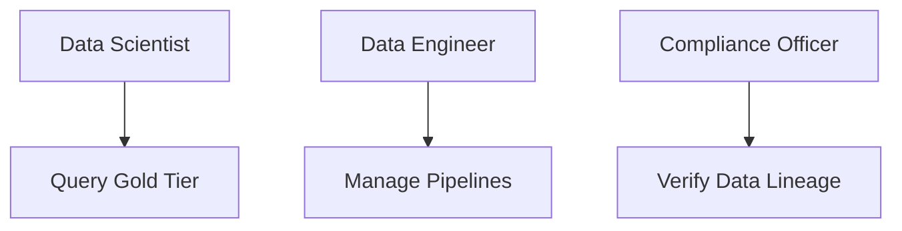

### 9. IaC Deployment: Lakehouse-as-Code Framework
Using modular Terraform to deploy and manage the versioned distribution of the data tracking hubs, compute clusters, and forensic metadata lakes.

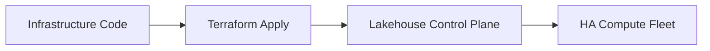

### 10. AIOps Data Anomaly & Drift Validation Flow
Using advanced analytics to identify sudden schema changes, data quality drops, or unexpected volume spikes that could result in institutional data corruption.

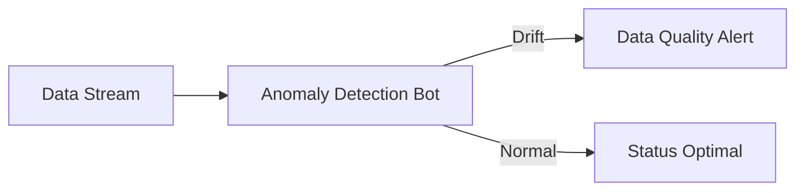

### 11. Metadata Lake for Forensic Data Audit
Storing long-term records of every ETL run, every query executed, and every access grant for institutional record-keeping, compliance auditing, and post-processing forensics.

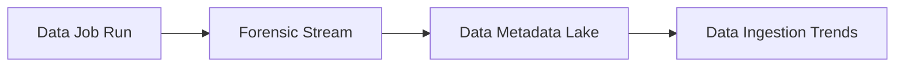

---

## 🏛️ Core Lakehouse Pillars

1.  **Unified Data Coordination**: Maximizing visibility by centralizing all data streams through a single institutional plane.
2.  **Automated Quality Validation**: Eliminating "garbage in" scenarios through proactive schema and quality verification.
3.  **Sequential Medallion Refinement**: Ensuring high-integrity insights through dependency-aware tier transitions.
4.  **Zero-Trust Data Protection**: Automatically enforcing RBAC/ABAC and data masking across all storage tiers.
5.  **Autonomous Processing Logic**: Guaranteeing data availability through automated pipeline recovery runbooks.
6.  **Full Data Auditability**: Immutable recording of every ETL step and query for institutional forensics.

---

## 🛠️ Technical Stack & Implementation

### Lakehouse Engine & APIs
*   **Framework**: Python 3.11+ / FastAPI / PySpark.
*   **Compute Hub**: Managed Spark (AWS EMR / Azure Databricks / GCP Dataproc).
*   **Table Formats**: Delta Lake, Apache Iceberg, or Apache Hudi for ACID transactions.
*   **Persistence**: PostgreSQL (Metadata Registry) and Redis (Live Job State).
*   **Auth Orchestrator**: Federated OIDC/SAML for least-privilege data access.

### Data Intelligence Dashboard (UI)
*   **Framework**: React 18 / Vite.
*   **Theme**: Dark, Indigo, Slate (Modern high-fidelity data aesthetic).
*   **Visualization**: D3.js for lineage graphs and Recharts for data quality analytics.

### Infrastructure & DevOps
*   **Runtime**: AWS EKS or Azure Kubernetes Service (AKS) for management plane.
*   **Workflow Hub**: Managed Apache Airflow or Prefect.
*   **IaC**: Modular Terraform for deploying the lakehouse landing zone and compute fleet.

---

## 🏗️ IaC Mapping (Module Structure)

| Module | Purpose | Real Services |
| :--- | :--- | :--- |
| **`infrastructure/data_hub`** | Central management plane | EKS, PostgreSQL, Redis |
| **`infrastructure/compute`** | Spark & Query compute fleet | EMR, Databricks, Athena |
| **`infrastructure/storage`** | Medallion storage tiers | S3, ADLS, GCS |
| **`infrastructure/auditing`** | Forensic data sinks | S3, Athena, Quicksight |

---

## 🚀 Deployment Guide

### Local Principal Environment
```bash
# Clone the lakehouse platform
git clone https://github.com/devopstrio/lakehouse-iac.git
cd lakehouse-iac

# Configure environment
cp .env.example .env

# Launch the Lakehouse stack
make init

# Trigger a mock data ingestion and medallion refinement simulation
make simulate-lakehouse
```

Access the Data Intelligence Hub at `http://localhost:3000`.

---

## 📜 License
Distributed under the MIT License. See `LICENSE` for more information.

---
<div align="center">
  <p>© 2026 Devopstrio. All rights reserved.</p>
</div>
