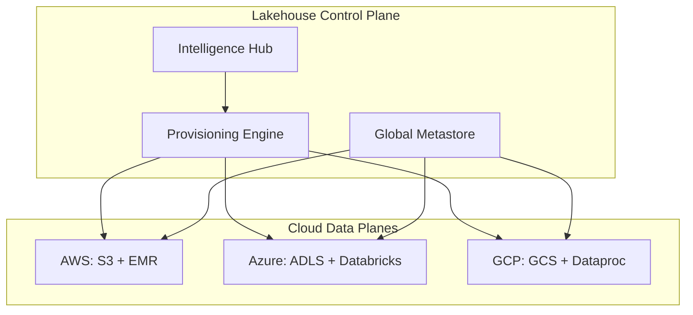
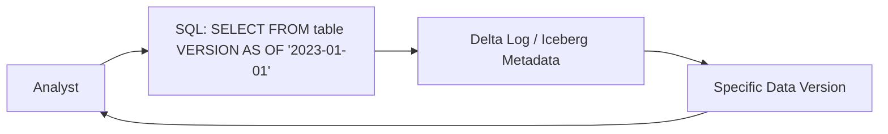
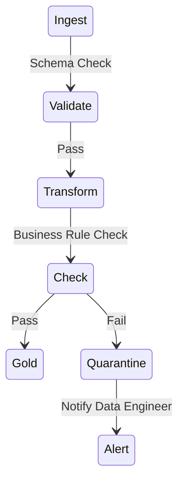

# Architecture & Governance Diagrams

## 11. Multi-Cloud Lakehouse Topology (Detailed)
*How the platform orchestrates unified data across cloud providers.*

## 13. "Time Travel" Query Architecture

## 20. End-to-End Data Quality Loop

