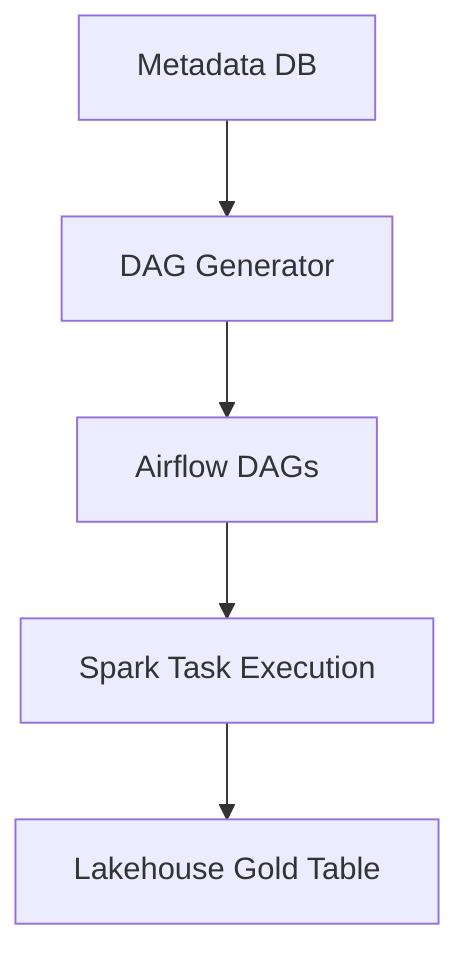
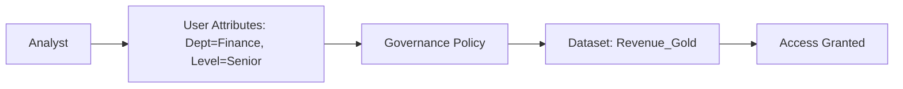
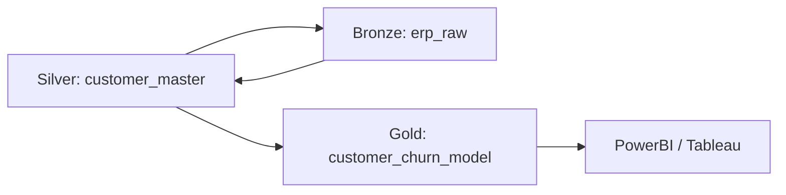

# Pipeline & Lineage Diagrams

## 31. Metadata-Driven Pipeline Generation

```mermaid
graph TD
    DB[Metadata DB] --> Generator[DAG Generator]
    Generator --> Airflow[Airflow DAGs]
    Airflow --> Spark[Spark Task Execution]
    Spark --> Sink[Lakehouse Gold Table]
```

## 34. Attribute-Based Access Control (ABAC)

```mermaid
graph LR
    User[Analyst] --> Claims[User Attributes: Dept=Finance, Level=Senior]
    Claims --> Policy[Governance Policy]
    Policy --> Data[Dataset: Revenue_Gold]
    Data --> Access[Access Granted]
```

## 40. Data Lineage Visualization

```mermaid
graph LR
    S[Source: ERP] --> B[Bronze: erp_raw]
    B --> S[Silver: customer_master]
    S --> G[Gold: customer_churn_model]
    G --> BI[PowerBI / Tableau]
```
